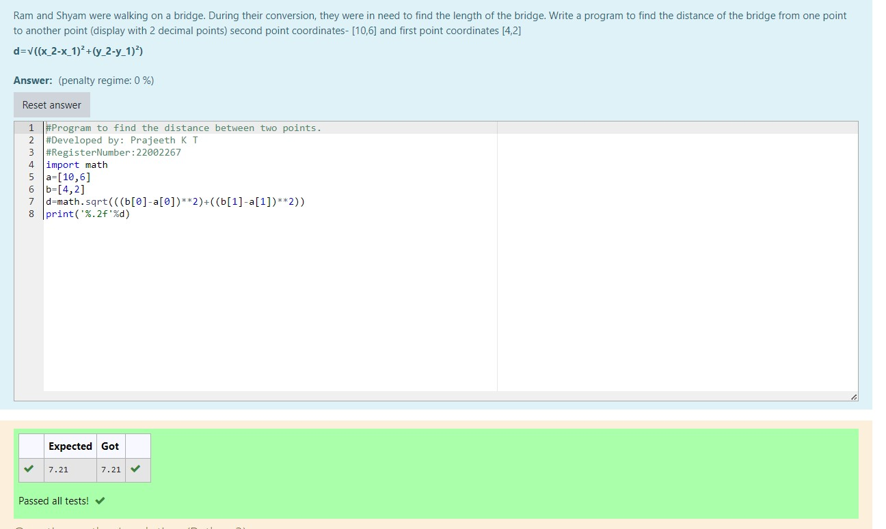

# DISTANCE-BETWEEN-TWO-POINTS

## AIM:
To write a python program to find the distance two 2 points

## ALGORITHM:

### Step 1: 
Import math
### Step 2:
Assign the value of two points
### Step 3: 
Substitute the values in the distance formula  
### Step 4: 
Print the values
### Step 5: 
End the program
### PROGRAM:
```python
#Program to find the distance between two points.
#Developed by: Prajeeth K T
#RegisterNumber:22002267
import math
a=[10,6]
b=[4,2]
d=math.sqrt(((b[0]-a[0])**2)+((b[1]-a[1])**2))
print('%.2f'%d)
```

### OUTPUT:


### RESULT:
Thus the distance between two points evaluated successfully